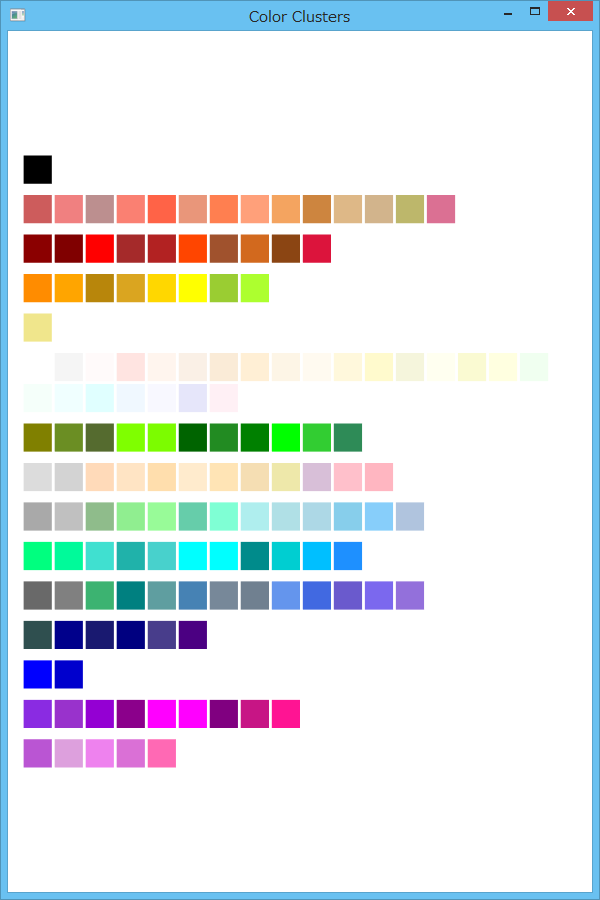

## Bellona.Analysis

The library for statistical analysis.

### Setup
To install Bellona.Analysis, run the following command in the Package Manager Console on Visual Studio:

```
Install-Package Bellona.Analysis
```

[NuGet Gallery | Bellona.Analysis](https://www.nuget.org/packages/Bellona.Analysis/)

### Usage for Clustering

#### Simplest Way
The following code creates a trained clustering model with colors data.

```c#
// Colors data.
var colors = new[] { Color.Red, Color.Orange, Color.Yellow, Color.Green, Color.Blue, Color.Indigo, Color.Violet };

// Initializes and trains a clustering model.
// The lambda expression is to extract features from each color by an array of System.Double.
var model = ClusteringModel.CreateAuto<Color>(c => new double[] { c.R, c.G, c.B })
    .Train(colors);
```

The number of clusters doesn't need to be specified for `CreateAuto` method.

Remark that `ClusteringModel<T>` objects are immutable.
`CreateAuto` method returns an empty model, and `Train` method returns a trained model.
So use method chaining.

#### Use Result
You can access the trained result via `Clusters` property.

```c#
// Gets a cluster in the trained model.
var cluster0 = model.Clusters[0];
Console.WriteLine(cluster0.Id);

// Enumerates colors in cluster0.
foreach (var record in cluster0.Records)
    Console.WriteLine(record.Element.Name);
```

#### Specify Parameters

```c#
// Specifies the maximum number of clusters and the maximum standard score in σ.
var model = ClusteringModel.CreateAuto<Color>(c => new double[] { c.R, c.G, c.B })
    .Train(colors, 20, 1.5);
```

Use `CreateFromNumber` method to fix the number of clusters.

```c#
// Specifies the number of clusters and the maximum number of iterations.
var model = ClusteringModel.CreateFromNumber<Color>(c => new double[] { c.R, c.G, c.B }, 10)
    .Train(colors, 30);
```

#### More Actions

```c#
// Assigns the gold to the suitable cluster.
var cluster = model.Assign(Color.Gold);

// Adds more data to an existing model.
var model2 = model.Train(colors2);
```

Remark that `Assign` method doesn't train the model with the new data.

### Samples

The following figure is the result of clustering colors in [the Color structure](https://msdn.microsoft.com/ja-jp/library/system.drawing.color.aspx).  


The sample source code is [ColorsSample](Samples/ColorsSample).

### Prerequisites
* .NET Framework 4.5

### Release Notes
* **v1.0.10** Add the features for clustering.
